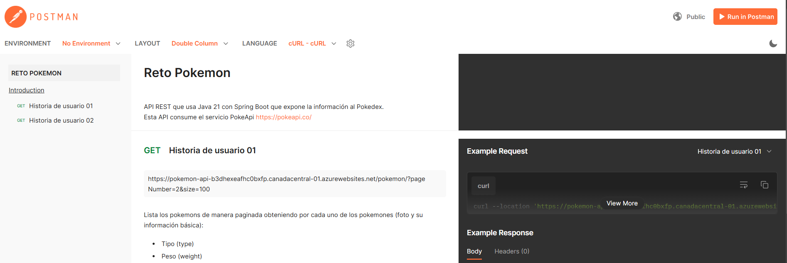
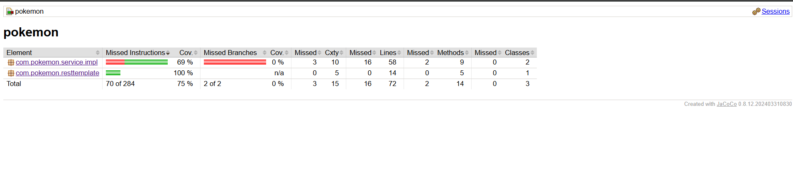
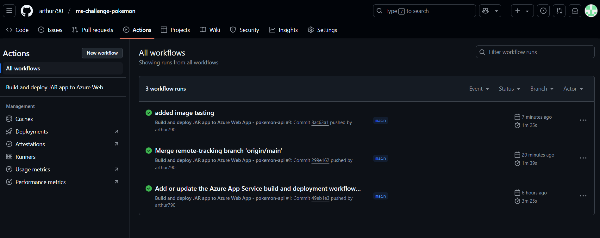

# Acerca del proyecto

Esta API consume el servicio PokeApi https://pokeapi.co/ para obtener la información. 
La documentación la puedes encontrar en https://pokeapi.co/docs/v2

## En este proyecto se cubren las siguientes necesidades:


### Historia de usuario 01

Como usuario, quiero listar (ya sea con una interfaz front-end o con un endpoint de API usando curl o postman) los pokemons de manera paginada obteniendo por cada uno de los pokemones (foto y su información básica):
- Tipo (type)
- Peso (weight)
- Listado de Habilidades (ability)

### Historia de usuario 02

Como usuario, quiero ver el detalle de un pokemon (ya sea clickeando uno del listado anterior en la interfaz front-end o con un endpoint de API usando curl o postman) mostrando su ficha descriptiva junto a su foto e información Básica (la misma del listado anterior), además de:
- Descripción
- Evoluciones

## Documentación y uso de endpoints

La documentación del uso de los endpoints la encontrarás en https://documenter.getpostman.com/view/27525327/2sAYk7Rj1E

## Mejoras en rendimiento
Para mejorar el rendimiento de la API se hace uso de cache con **Caffeine**, considerar para usar de manera distribuida un Redis.
Para estos fines de reto **Caffeine** cumple con la tarea puesto que podemos trabajar con cache de manera local.

## Ejecutar pruebas unitarias
Se incluyen pruebas unitarias, solo hay que ejecutar:

```sh
	mvn clean install
```

con el plugin **jacobo** se genera un reporte en la carpeta target, el porcentaje de cobertura que le aplique fue del 70%:




## Despliegue
Se encuentra desplegada en AZURE, como una app-service con java 21, por medio de github/Actions, por lo tanto cada que se realice un push a la rama **main** en automatico se realizará el deploy
